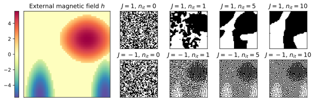
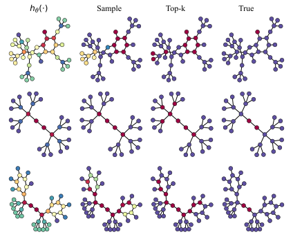

# Ising on the Graph: Task-specific Graph Subsampling via the Ising Model (LoG 2024)

Authors: Maria Bånkestad, Jennifer R. Andersson, Sebastian Mair, Jens Sjölund

[](https://www.apache.org/licenses/LICENSE-2.0)

[**[Paper]**](https://arxiv.org/abs/2402.10206)


This repository contains the code for the paper *Ising on the Graph: Task-specific Graph Subsampling via the Ising Model*, accepted at **The Third Learning on Graphs Conference (LoG 2024)**.

We propose a **task-specific graph reduction method** using an Ising model defined on nodes or edges, with the external magnetic field learned by a graph neural network. Unlike traditional unsupervised methods, our approach learns to reduce graphs tailored to specific tasks, even when the task's loss function is non-differentiable.

Our method is versatile and applicable to various tasks, including:
- **Image segmentation**
- **Graph explainability**
- **3D shape sparsification**
- **Sparse matrix inverse approximation**

---

## Method Overview
We propose a novel graph reduction method using an Ising model, where the external magnetic field \(h\) is parameterized by a graph neural network (GNN). This approach models node and edge interactions to identify subgraphs relevant to a specific downstream task. Sampling is guided by the magnetic field and coupling constant \(J\), which control node inclusion probabilities and relationships between neighboring nodes.

Our method leverages energy-based models to define probabilities via the Boltzmann distribution and uses efficient parallel sampling through graph coloring. This allows the model to be trained end-to-end for both differentiable and non-differentiable task losses, making it versatile for applications like image segmentation, graph explainability, and more.



**Figure:** *The external magnetic field \(h\) (left) varies across the graph and influences sampling probability based on its strength. The coupling constant \(J\) determines whether neighboring spins attract (top right) or repel (bottom right).*

One of our key applications is **graph explainability**, where the **IGExplainer** learns a magnetic field to identify subgraphs most crucial for a model's predictions.

<div align="center">
  
</div>

**Figure:** *Visualization of the magnetic field \(h\) and samples from the IGExplainer trained on a prediction model for the Mutagenicity dataset. From left to right: the magnetic field \(h\), the sampled subgraph, the top 40% most important nodes, and the ground truth.*

---

## Training and Evaluation
To train the GNN prediction model on the Mutagenicity dataset, run:
```bash
python train_model.py --config model_config_file_name
```
To train the IGExplainer, run:
```bash
python train_explainer.py --config explainer_config_file_name
```

A model visualization if found in *visualize_results.ipynb*.

## Citation

If you find this work helpful, please cite:


```
@inproceedings{
b{\r{a}}nkestad2024ising,
title={Ising on the Graph: Task-specific Graph Subsampling via the Ising Model},
author={Maria B{\r{a}}nkestad and Jennifer R. Andersson and Sebastian Mair and Jens Sj{\"o}lund},
booktitle={The Third Learning on Graphs Conference},
year={2024},
url={https://openreview.net/forum?id=HFRCBCHHz4}
}
```

Feel free to explore the code and experiment with our method. If you encounter any issues or have questions, don't hesitate to open an issue or submit a pull request. 🚀
